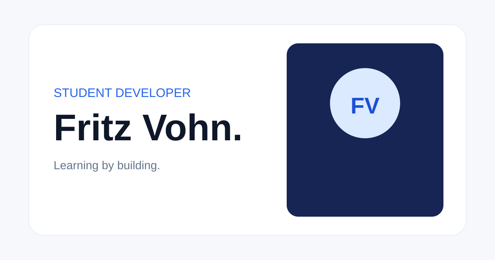

# Fritz Vohn — Student Developer Portfolio

A responsive, card-based personal portfolio for Fritz Vohn, a Grade 12 TVL-ICT student at Lourdes College. The site presents Fritz's learning journey honestly and provides structured spaces for verified projects and contact details.



## Features

- Responsive card-based interface for desktop, tablet, and mobile
- Accessible mobile navigation, focus states, semantic structure, and reduced-motion support
- Technology cards using official Devicon artwork
- Data-driven project rendering with an honest empty state
- Configurable contact cards, Gmail compose link, and copy-to-clipboard interaction
- SEO, Open Graph, favicon, and automatic footer year

## Technologies

HTML5, CSS3, and vanilla JavaScript. The site has no build step or runtime dependencies.

## Local setup

```bash
python3 -m http.server 8080
```

Open `http://localhost:8080`. Update personal contact placeholders in `js/config.js`. Add only verified projects to the `PROJECTS` array in `js/data.js`.

## Deployment

The static site is designed for GitHub Pages from the `main` branch. Once Pages is enabled, the public URL is recorded here:

- **Live site:** Pending first GitHub Pages publication
- **Repository:** Current `Portfolio` repository

## Project structure

```text
├── assets/              # Favicon and social preview
├── js/
│   ├── app.js           # Rendering and interactions
│   ├── config.js        # Easy-to-edit personal contact details
│   └── data.js          # Technologies and project records
├── index.html           # Semantic page structure
├── styles.css           # Design system and responsive layouts
└── README.md
```
